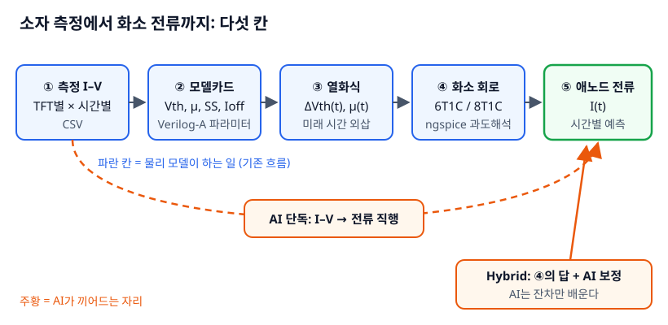

# TFT 열화 → OLED 애노드 전류 예측: 쉽게 배우는 교재

**ngspice + Verilog-A + 머신러닝으로, 소자 열화 측정에서 6T1C·8T1C 화소의 시간별 애노드 전류까지**

> 대상: 전자공학 석·박사 과정 (소자·회로·ML 중 하나는 익숙하고 나머지는 처음인 사람)
> 난이도 표기: **L3** — 정식 용어를 쓰되, 새 개념마다 일상 비유 하나와 "그 비유가 틀리는 지점"을 같이 적었다.



## 한 문장으로

TFT 한 개의 I–V를 시간별로 재서 **모델 파라미터 → 열화식 → 화소 회로 시뮬레이션** 순서로 넘기면 미래의 애노드 전류를 계산할 수 있고, AI는 이 물리 흐름을 **대체할 때보다 남은 오차를 보정할 때** 더 믿을 만했다 (이 교재의 합성 예제 기준).

## 먼저 알아둘 경계

- **모든 데이터는 합성값이다.** 공개 문헌 수준 파라미터로 만든 "정답 모델"이 측정값을 대신 만든다. 회사·학교 실측 데이터, PDK, 사내 모델카드는 들어 있지 않다.
- 6T1C는 교과서형 공개 토폴로지다. 8T1C는 확장 연습용 예시 하나이며 특정 제조사 회로가 아니다.
- 결과 수치는 난수 시드 1개, 합성 모집단 1개에서 나왔다. "이 방법이 항상 낫다"는 증거가 아니라 **실험 설계를 연습하는 교보재**다.

## 목차

| 장 | 제목 | 핵심 질문 | 코드 |
|---|---|---|---|
| 0 | [큰 그림](textbook/ch00_big_picture.md) | 왜 TFT 하나의 열화가 화소 전류 문제인가 | — |
| 1 | [설치와 연기 시험](textbook/ch01_setup.md) | 내 컴퓨터에서 Verilog-A가 도는가 | `code/smoke` |
| 2 | [Verilog-A로 늙는 TFT 만들기](textbook/ch02_verilog_a_tft.md) | 시간을 파라미터로 넣는다는 게 무슨 뜻인가 | `code/01_tft_aging` |
| 3 | [측정값에서 모델카드 뽑기](textbook/ch03_measure_extract.md) | 정답을 모를 때 어떻게 채점하나 | `code/02_pipeline` 1–2단계 |
| 4 | [열화식과 블라인드 예측](textbook/ch04_aging_law.md) | 1000시간 데이터로 3000시간을 맞힐 수 있나 | 3단계 |
| 5 | [6T1C 화소 회로와 애노드 전류](textbook/ch05_pixel_6t1c.md) | 어느 TFT가 전류를 가장 많이 깎나 | 4–6단계 |
| 6 | [기존 흐름 vs AI vs Hybrid](textbook/ch06_ml_vs_physics.md) | AI는 어디서 이기고 어디서 무너지나 | 7단계 |
| 7 | [실측 데이터와 8T1C로 옮기기](textbook/ch07_real_data_8t1c.md) | 내 데이터·내 회로에 적용하려면 무엇을 바꾸나 | `code/03_extension_8t1c` |
| 8 | [AI 코딩 에이전트와 같이 만들기](textbook/ch08_ai_agents.md) | AI에게 시뮬레이션 코드를 맡길 때 무엇을 검증하나 | — |
| 9 | [8T1C 히스테리시스와 프레임 응답](textbook/ch09_hysteresis_8t1c.md) | T8이 막으려는 현상을 넣으면 달라지나 | `code/04_hysteresis_8t1c` |
| 10 | [공동연구로 옮기기](textbook/ch10_collab_snu.md) | 측정팀·회로팀과 무엇을 맞추나 | — |
| 부록 | [함정 모음·용어·HSPICE 차이](textbook/appendix.md) | 막혔을 때 먼저 볼 곳 | — |

## 빠르게 돌려보기

```bash
git clone https://github.com/waterfirst/tft_ngspice_velilog-a.git
cd tft_ngspice_velilog-a/code
python3 -m venv .venv && . .venv/bin/activate
pip install -r requirements.txt
# ngspice(39 이상)와 openvaf가 PATH에 있어야 한다 → 1장
bash run_all.sh        # 전체 약 1분 (16코어 기준). dataset.npz 재생성은 제외
```

`run_all.sh`가 끝나면 `code/02_pipeline/figs/`에 채점 그림 두 장이 생긴다. 이 저장소에 들어 있는 결과 파일과 **바이트 단위로 같게** 재현되는지 확인했다 (ngspice 45.2, OpenVAF-Reloaded, Python 3.12, numpy 2.5.3, scipy 1.18.1, scikit-learn 1.9.1).

## 폴더

```
code/
  smoke/              1장  Verilog-A 저항 하나로 설치 확인
  01_tft_aging/       2장  늙는 n형 TFT + 교과서 2T1C
  02_pipeline/        3–6장 6T1C LTPO 파이프라인 (측정→추출→열화식→화소→채점→ML)
  03_extension_8t1c/  7장  T7·T8을 붙인 8T1C 확장 연습
  04_hysteresis_8t1c/ 9장  트랩 상태 모델 + 60 Hz 프레임 응답 (6T1C vs 8T1C)
textbook/             본문 (Markdown) + figs/ (SVG)
```

## 라이선스

코드와 본문 모두 MIT. 인용 시 저장소 URL을 적어주면 된다.
