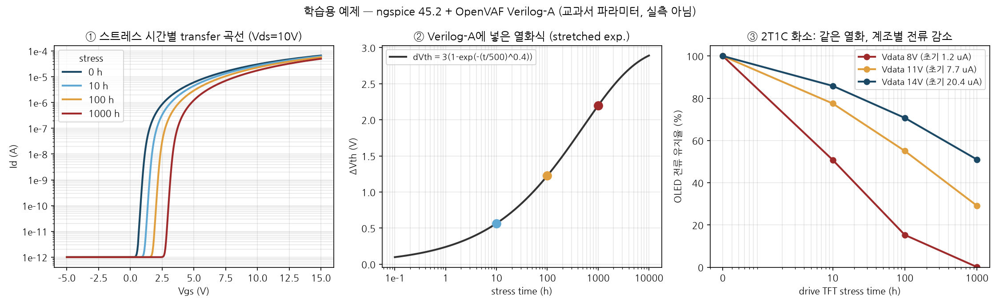

# 2장. Verilog-A로 열화 TFT 모델 만들기

`L3` · 45분 · 코드 `code/01_tft_aging/`

---

## 한 문장

TFT 전류식에 **스트레스 시간 `TSTRESS`를 파라미터로** 넣고 문턱전압을 `Vth = VTH0 + ΔVth(TSTRESS)`로 만들면, 같은 회로를 시간값만 바꿔 여러 번 돌려 "0 h, 10 h, 100 h, 1000 h 뒤의 화소"를 볼 수 있다.

## 큰 그림



- ① 시간이 지나면 transfer 곡선이 오른쪽으로 평행이동한다 (n형, Vth 증가)
- ② 그 이동량을 정한 식: `ΔVth = 3·(1 − exp(−(t/500)^0.4))` V → 10 h 0.57 V, 100 h 1.23 V, 1000 h 2.20 V
- ③ 보상 회로가 없는 2T1C에 넣으면 **같은 ΔVth인데 저계조일수록 전류가 훨씬 많이 줄어든다**

| Vdata | 0 h | 10 h | 100 h | 1000 h |
|---|---|---|---|---|
| 8 V (저계조) | 1.20 µA | 50.8% | 15.3% | **0.1%** |
| 11 V | 7.70 µA | 77.5% | 55.0% | 29.1% |
| 14 V (고계조) | 20.4 µA | 85.9% | 70.7% | 51.0% |

## 비유: 문턱이 높아지는 현관

전류는 **현관 문턱을 넘어 들어오는 사람들**이다. 게이트 전압은 **사람들이 가진 발 높이**, 문턱전압은 **문턱 높이**다.

- 문턱을 넘는 여유(오버드라이브 = Vgs − Vth)만큼 사람이 들어온다. 여유가 두 배면 대략 네 배가 들어온다 (포화영역 I ∝ (Vgs−Vth)²).
- 시간이 지나 **문턱이 2.2 V 높아지면**, 발 높이가 14 V인 사람들에겐 조금 불편한 정도지만 8 V인 사람들에겐 **거의 못 넘는 벽**이 된다.
- 그래서 같은 열화가 저계조 화소를 먼저 죽인다. 표의 8 V 열이 그 장면이다.

## 그래서 뭐

1. **열화의 영향은 소자 값만으로 결정되지 않는다.** 동작점(계조)을 같이 알아야 한다. 수명 평가를 한 계조에서만 하면 다른 계조의 수명을 과대평가할 수 있다.
2. **보상 회로의 존재 이유가 숫자로 보인다.** 5장의 6T1C는 3000 h 뒤에도 저계조 전류를 79% 유지한다 (소자·파라미터가 달라 직접 비교는 아니지만, 방향은 분명하다).
3. **시간을 모델 파라미터로 넣는 방식**은 SPICE 입장에서 시간 0짜리 회로를 여러 개 돌리는 것이다. 열화가 한 프레임(16.7 ms) 안에서는 일어나지 않는다고 가정하는 것 — 수천 시간 대 수 밀리초라 합리적이다.

## 비유가 깨지는 곳

1. **문턱은 계속 높아지기만 하지 않는다.** 실제 TFT는 스트레스를 멈추면 일부 회복하고, 극성에 따라 Vth가 음의 방향으로 가기도 하며(NBTS vs PBTS), 이동도·SS·누설도 같이 변한다. 이 워밍업 모델은 Vth만 움직인다.
2. **사람 수 = 전류가 딱 제곱은 아니다.** 이 장의 모델도 채널 길이 변조(`LAMBDA`)와 선형–포화 사이의 부드러운 전이 때문에 제곱에서 조금 벗어나고, 3장 모델은 게이트 전압 의존 이동도(`pow(veff, GAMMA)`)까지 넣어 지수가 2보다 커진다.
3. **2T1C에서 전류가 0.1%까지 떨어진 건 이 교재 파라미터의 결과다.** DVMAX 3 V는 일부러 크게 잡았다. 실제 패널 TFT 열화량으로 읽지 않는다.

---

## 직접 해보기

### 1) 모델 핵심 부분 읽기 (`tft_aging.va`)

```verilog
parameter real TSTRESS = 0   from [0:inf);  // stress time [h]
parameter real DVMAX   = 3.0;
parameter real TAU     = 500 from (0:inf);  // [h]
parameter real BETA    = 0.4 from (0:1];

dvth = DVMAX * (1.0 - exp(-pow(TSTRESS / TAU, BETA)));
vth  = VTH0 + dvth;

x = (vgs - vth) / (n * vt);                 // 문턱 대비 여유를 열전압 단위로
if (x > 30.0) veff = vgs - vth;             // 문턱 위: 그대로
else          veff = n * vt * ln(1.0 + exp(x));  // 문턱 근처·아래: softplus로 지수 → 선형을 매끄럽게

vdse = vds / pow(1.0 + pow(vds / (veff + 1e-12), 4.0), 0.25);   // 선형 ↔ 포화 매끄러운 전이
id   = MU*CI*W/L * (veff*vdse - 0.5*vdse*vdse) * (1 + LAMBDA*vds) + IOFF*vds;
```

세 가지 요령:

- **softplus** `n·Vt·ln(1+e^x)`: x가 크면 `Vgs−Vth`, 작으면 `n·Vt·e^x`(서브문턱 지수). 한 식으로 두 영역을 잇는다. `SS`(V/dec)는 `n = SS/(Vt·ln10)`으로 들어간다.
- **소스/드레인 대칭**: `V(d,s) < 0`이면 두 단자를 바꿔 계산하고 부호를 뒤집는다. 화소 안 스위치 TFT는 전류 방향이 프레임마다 바뀌므로 필수다.
- **게이트 커패시턴스** `I(g,s) <+ 0.5*CI*W*L*ddt(V(g,s))`: 과도해석에서 킥백·충전을 보려면 넣어야 한다.

### 2) 돌리기

```bash
cd code/01_tft_aging
openvaf tft_aging.va
ngspice -b transfer.cir        # 0/10/100/1000 h transfer → transfer.txt
ngspice -b pixel_2t1c.cir      # Vdata 8/11/14 V × 4개 시간 → pixel_vdata_*
python plot.py                 # tft_aging_study.png
```

`transfer.cir`의 요점 — **시간마다 `.model`을 하나씩** 만든다:

```spice
.model t0000 tft_aging TSTRESS=0
.model t1000 tft_aging TSTRESS=1000
N1 d1 g 0 t0000
N4 d4 g 0 t1000
```

### 3) 이 장에서 실제로 밟은 함정

| 증상 | 원인 | 해결 |
|---|---|---|
| Vgs를 올려도 전류가 약 8.7 V 오버드라이브에서 멈춤 | `ln(1+limexp(x))`: `limexp`는 x가 커지면 선형으로 바뀌어 `ln`이 포화 | `x > 30`이면 `veff = vgs − vth`로 분기 |
| `wrdata f.txt -i(V1) -i(V2)` 결과가 열 하나 | 공백으로 띄운 `-`가 **뺄셈 한 번**으로 해석됨 | `i(V1) i(V2)`로 쓰고 부호는 Python에서 |
| `.control`의 `pixel_$vd.txt`가 빈 이름 | `$vd.txt` 전체를 변수 이름으로 읽음 | 확장자 없이 `pixel_vdata_$vd` |

### 4) 바꿔보기

- `BETA`를 0.4 → 0.8로 바꾸고 `openvaf` 재컴파일 후 다시 돌려보자. 초반 열화와 후반 열화 중 어느 쪽이 커지는가?
- `pixel_2t1c.cir`에서 스위치 TFT(`swm`)도 `TSTRESS=1000`으로 바꿔보자. 전류가 얼마나 변하는가? 스위치가 켜져 있는 시간(쓰기 구간 1 ms)과 게이트–소스 여유(스캔 15 V vs Vdata)를 연결해 설명해보자.

---

> **적용 질문**
> 여러분이 측정한 TFT가 1000 h에 ΔVth = 0.3 V라면, 보상 없는 2T1C의 저계조 전류는 이 장의 8 V 열보다 덜 떨어질까 더 떨어질까? 판단하려면 **ΔVth 말고 어떤 숫자가 하나 더** 필요한가?

[← 1장](ch01_setup.md) · [다음: 3장 측정값에서 모델카드 뽑기 →](ch03_measure_extract.md)
