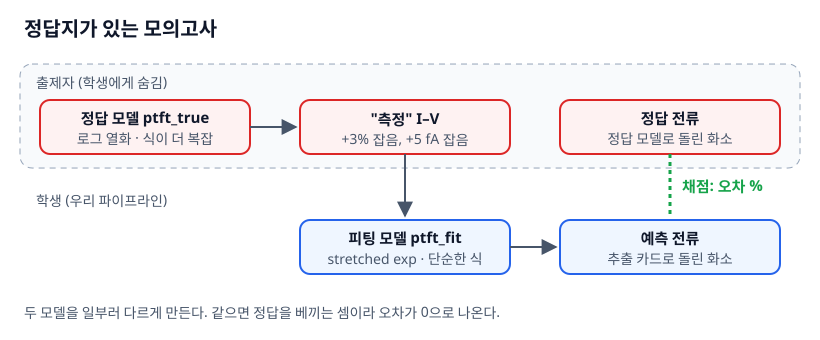
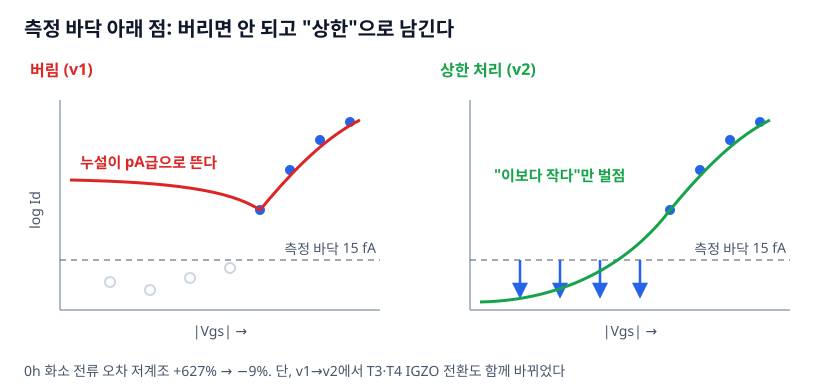

# 3장. 측정값에서 모델카드 뽑기 — 정답을 모를 때 어떻게 채점하나

`L3` · 60분 · 코드 `code/02_pipeline/` 1–2단계 (`gen_meas.py`, `extract.py`)

---

## 한 문장

실측에서는 "진짜 TFT 파라미터"를 영원히 모르므로, 이 교재는 **숨겨둔 정답 모델로 가짜 측정값을 만들고, 그보다 단순한 모델로 추출한 뒤, 최종 전류를 정답과 비교**한다. 방법이 검증되면 가짜 측정값 자리에 실측을 넣는다.

## 큰 그림



| | 정답 모델 `ptft_true.va` | 피팅 모델 `ptft_fit.va` |
|---|---|---|
| 역할 | 측정값 생성 (학생에게 숨김) | 파라미터 추출·화소 예측 |
| 문턱 | `VT0 + 열화 − SIGMA·Vsd` (드레인 전압이 문턱을 낮춤) | `VT0 + 열화` |
| 이동도 | `U0·veff^GAMMA / (1 + THETA·veff)` | `U0·veff^GAMMA` |
| 열화식 | **로그**: `AVT·ln(1 + (t/τ)^β)` | **stretched exp**: `AVT·(1 − e^−(t/τ)^β)` |
| 누설 | `GOFF·Vsd·(1 + 0.1·Vsd)` | `GOFF·Vsd` |

LTPO 화소를 흉내 내 6개 TFT 중 **T3·T4는 IGZO NMOS**, 나머지는 **LTPS PMOS**로 뒀다. 한 Verilog-A 모듈이 `POL=+1`(PMOS)/`−1`(NMOS) 파라미터로 둘 다 표현한다.

## 비유: 모의고사와 정답지

실제 패널은 **정답지가 없는 수능**이다. 그래서 먼저 **출제자가 정답지를 가진 모의고사**로 풀이법을 검증한다.

- 출제자(정답 모델)는 학생이 모르는 복잡한 규칙으로 문제(측정 I–V)를 낸다.
- 학생(피팅 모델)은 더 단순한 공식으로 푼다. **공식이 출제 규칙과 달라야** 진짜 실력이 드러난다. 같은 공식이면 답을 베끼는 셈이다.
- 채점은 문제 하나하나(I–V 곡선 맞춤)가 아니라 **최종 점수(화소 전류)**로 한다.

## 그래서 뭐

1. **"피팅 RMS가 작다" ≠ "화소 전류가 맞다".** 5장에서 보겠지만 0 h 추출 카드만으로도 화소 전류가 저계조 −9% 틀린다. I–V 곡선 오차가 몇 %인지보다 **회로 출력 오차**로 채점해야 한다.
2. **측정 바닥 아래 점을 어떻게 다루느냐가 저계조 결과를 뒤집는다** (아래 그림).
3. 실측으로 옮길 때도 이 구조를 유지할 수 있다. "정답 모델" 자리에 **실제로 잰 테스트 화소의 애노드 전류**를 두면 된다 (7장).

## 비유가 깨지는 곳

1. **실측의 오차는 우리가 넣은 잡음보다 못됐다.** 여기서는 3% 곱셈 잡음 + 5 fA 계측 잡음(정규분포)만 넣었다. 실측에는 히스테리시스, 측정 순서에 따른 스트레스 누적, 접촉저항, 소자 간 체계적 편차가 있다.
2. **정답 모델도 결국 모델이다.** 정답 모델과 피팅 모델의 차이가 실제 TFT와 피팅 모델의 차이를 대표한다는 보장은 없다. 이 방법은 **파이프라인의 버그와 구조적 약점**을 찾는 데 쓰고, 실제 정확도는 실측 화소로 따로 확인해야 한다.
3. **모의고사는 한 벌이다.** 난수 시드 1개(`truth_params(seed=7)`)로 만든 TFT 6개다. 시드를 바꾸면 수치가 달라진다.

---

## 측정 바닥 아래 점: 버리지 말고 "상한"으로



측정기는 15 fA(잡음의 3σ) 아래를 믿을 수 없다. 여기서 흔히 하는 실수가 **그 점들을 지우고 피팅**하는 것이다.

- 지우면 누설 파라미터 `GOFF`를 붙잡는 데이터가 사라진다. 최적화는 `GOFF`를 pA급으로 올려도 벌점을 안 받는다.
- 그 누설이 화소의 **hold 구간(한 프레임 16 ms 동안) 게이트를 방전**시키고, 저계조 전류가 크게 틀어진다.
- 해결: 바닥 아래 점은 "전류가 15 fA보다 작다"는 **부등식 정보**로 남긴다. 모델이 바닥보다 크게 예측할 때만 벌점을 준다. 통계에서 말하는 **검열(censored) 데이터**다.

```python
# extract.py
cen = sub.id_meas.values < FLOOR_A                      # 바닥 아래 점
def res(x):
    I = np.log10(np.maximum(id_fit(vsg, vsd, W, L, *x[:5], 10 ** x[5]), 1e-20))
    return np.where(cen,
                    np.maximum(I - np.log10(FLOOR_A), 0),  # 바닥 아래: 모델이 바닥을 넘을 때만 벌점
                    I - y)                                  # 나머지: 보통의 log 잔차
```

v1(모든 TFT LTPS + 바닥 아래 점 삭제) → v2(T3·T4 IGZO + 상한 처리)에서 0 h 화소 전류 오차가 고/중/저계조 **+81 / +185 / +627% → −4 / −6 / −9%**로 줄었다. 단, 이 비교는 두 가지를 동시에 바꿨으므로 **효과를 하나씩 분리하는 것이 연습문제 2**다.

---

## 직접 해보기

```bash
cd code/02_pipeline
(cd models && openvaf ptft_true.va && openvaf ptft_fit.va)
python check_twin.py   # 0. numpy로 쓴 같은 식 == ngspice 인지 확인
python gen_meas.py     # 1. 정답 모델로 "측정" I-V 생성 → data/measured_iv.csv
python extract.py      # 2. TFT별·시간별 모델카드 → cards/extracted_cards.json
```

### 0단계가 왜 필요한가: numpy 쌍둥이

추출은 수천 번 전류를 계산해야 한다. 매번 ngspice를 부르면 느리므로 **같은 식을 numpy로 한 번 더** 쓴다 (`fitmodel.py`). 대신 두 구현이 정말 같은지 먼저 확인한다.

```
WORST 1.04e-04 PASS
```

상대오차 1e-4는 ngspice 뉴턴 반복의 수치 잡음 수준이고, 측정 잡음 3%보다 300배 작다. 이 검사를 건너뛰면 Verilog-A 수정 후 numpy 식을 안 고친 채 추출하는 사고가 난다.

### 1단계 출력 읽기

```
TFT  기술   역할              스트레스  |Vth|이동@1000h  이동도감소@1000h
T1   LTPS   구동 TFT            0.341       0.635V          2.5%
T2   LTPS   데이터 스위치        0.048       0.115V          0.5%
T3   IGZO   문턱보상 스위치      0.048       0.115V          0.5%
T4   IGZO   게이트 초기화        0.048       0.115V          0.5%
T5   LTPS   발광 스위치(전원측)  5.092       2.090V          8.4%
T6   LTPS   발광 스위치(OLED측)  4.579       2.052V          8.2%
```

스트레스 지수는 `duty × (|Vgs|/5)²`로 정했다. 발광 스위치 T5·T6는 프레임의 94.6% 동안 |Vgs| 11 V 이상으로 켜져 있어 가장 많이 늙는다. **이 표만 보면 T5·T6가 제일 위험해 보인다.** 5장에서 이 직관이 틀린다.

측정 조건: transfer (|Vgs| −2→8 V, |Vds| 0.1·5 V) + output (|Vgs| 2·3·4·6 V), 시간 0·10·30·100·300·1000·3000 h, 총 37,212행. **3000 h는 `split=blind`로 표시해 추출·피팅에 쓰지 않는다.**

### 2단계: 무엇을 뽑나

`VT0, U0, GAMMA, SS, LAMBDA, log10(GOFF)` 6개를 log 전류 잔차로 최소제곱. 요령:

- **log 전류로 맞춘다.** 선형 전류로 맞추면 µA 영역만 맞고 서브문턱(pA)은 무시된다.
- **이전 시간의 해를 초기값으로** (`x0 = x`). 열화는 연속이라 수렴이 안정적이다.
- **파라미터 스케일을 알려준다** (`x_scale=[0.5, 20, 0.1, 0.1, 0.01, 1]`). U0(수십)와 LAMBDA(0.01)를 같은 걸음으로 움직이면 안 된다.

---

## 연습문제

1. `extract.py`에서 `cen` 처리를 빼고(바닥 아래 점 삭제) 다시 돌린 뒤 `run_pixels.py`, `grade.py`까지 돌려 저계조 0 h 오차를 보라. v2 상태에서 **상한 처리만** 바꾼 효과는 몇 %인가?
2. 반대로 상한 처리는 유지하고 `common.py`의 `IGZO = set()`(전부 LTPS)으로 바꿔보라. 두 효과 중 어느 쪽이 컸는가?
3. `gen_meas.py`의 곱셈 잡음 3%를 10%로 올리면 `cards/extraction_summary.csv`의 VT0 추출값이 시간에 따라 얼마나 흔들리는가? 그 흔들림이 4장 열화식 피팅에 어떤 문제를 만들까?

> **적용 질문**
> 여러분 측정 장비의 전류 바닥은 얼마인가? 그 바닥 아래 데이터를 지금 어떻게 처리하고 있는가 — 지우는가, 바닥값으로 채우는가, 부등식으로 쓰는가?

[← 2장](ch02_verilog_a_tft.md) · [다음: 4장 열화식과 블라인드 예측 →](ch04_aging_law.md)
