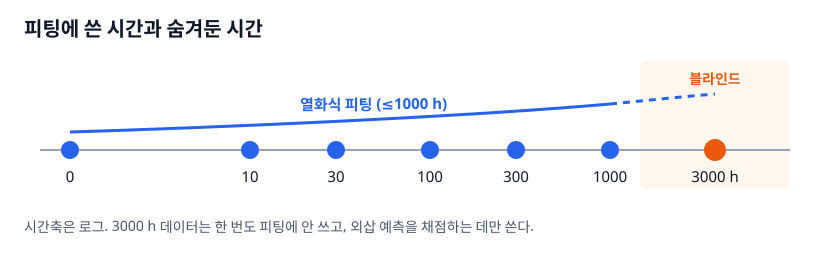

# 4장. 열화식과 블라인드 예측 — 1000시간으로 3000시간을 맞힐 수 있나

`L3` · 45분 · 코드 `code/02_pipeline/aging.py`

---

## 한 문장

시간별로 추출한 ΔVth와 이동도 감소를 **stretched exponential 식 하나로 이어 붙이면** 측정 안 한 시간의 모델카드를 만들 수 있다. 이 식을 믿어도 되는지는 **피팅에 안 쓴 3000 h 데이터로만** 판단한다.

## 큰 그림



```
ΔVth(t) = AVT · [1 − exp(−(t/TAUV)^BETAV)]
μ(t)/μ0 = 1 − AMU · [1 − exp(−(t/TAUM)^BETAM)]
```

`aging.py`가 하는 일:

1. 0 h 카드의 **모양 파라미터(GAMMA, SS, LAMBDA, GOFF)는 고정**하고, 각 시간에서 **VT0와 U0만** 다시 뽑는다.
2. 시간 0–1000 h의 ΔVth, 이동도 감소를 위 식에 `curve_fit`.
3. 3000 h에서 식의 값과 실제 추출값·정답을 비교한다.
4. 식의 계수(AVT, TAUV, BETAV, AMU, TAUM, BETAM)를 Verilog-A `ptft_fit`의 파라미터로 넘긴다 → `TSTRESS`만 바꾸면 어느 시간의 화소든 돌릴 수 있다.

## 비유: 아이 키 성장 곡선

1살부터 10살까지 키를 재서 **성장 곡선**을 그리면 15살 키를 짐작할 수 있다. 성장은 처음에 빠르고 점점 느려진다 — stretched exponential이 바로 그 모양이다(β<1이면 초반이 더 가파르다).

- 곡선 모양을 잘 골랐다면 15살 예측이 맞는다.
- 그런데 **사춘기 급성장**(측정 구간에 없던 현상)이 오면 틀린다.
- 그래서 **15살 실제 키(블라인드)를 하나는 남겨두고** 곡선을 채점해야 한다.

## 그래서 뭐

| TFT | ΔVth 정답 @3000 h | 열화식 예측 | 차이 | 이동도 감소 정답 | 열화식 |
|---|---|---|---|---|---|
| T1 구동 | 0.856 V | 0.843 V | −13 mV | 3.48% | 2.18% |
| T3 IGZO | 0.154 V | 0.140 V | −14 mV | 0.63% | 1.17% |
| T5 발광 | 2.818 V | 2.725 V | **−93 mV** | 11.4% | 10.5% |

1. **1000 h까지는 거의 완벽했는데 3000 h에서 일관되게 작게 예측한다.** 정답은 로그 법칙이라 끝없이 자라고, stretched exp는 AVT에서 포화하기 때문이다. 식의 모양 선택이 외삽 오차의 방향을 정한다.
2. **피팅 계수를 물리량으로 읽으면 안 된다.** T1의 AVT=1.11 V, TAUV=1371 h는 정답(로그식, τ=200 h)과 전혀 다른 숫자인데 1000 h 안에서는 곡선이 겹친다. T2·T3·T4의 TAUM이 17만~46만 h로 나온 것도 이동도 변화가 너무 작아 **식별이 안 된다**는 신호다.
3. 그런데도 **화소 전류로 채점하면 3000 h 블라인드 오차는 −1.2 / −1.7 / −4.0% (고/중/저계조)**로, 0 h 오차(−3.9 / −5.3 / −8.7%)보다 오히려 작다(5장). 오차의 대부분이 열화식이 아니라 **0 h 정적 모델의 차이**에서 온다는 뜻이다. 칸별로 채점해야 알 수 있는 사실이다.

## 비유가 깨지는 곳

1. **아이 키와 달리 TFT는 되돌아간다.** 스트레스를 끊으면 회복하고, 켜고 끄는 패턴(duty)과 온도에 따라 곡선 자체가 바뀐다. 이 교재는 연속 스트레스 한 조건만 다뤘다.
2. **성장 곡선은 한 사람의 곡선이다.** 실측에서는 같은 공정 TFT도 개체마다 곡선이 다르다. 식을 **개체별로 뽑을지, 모집단 평균 + 산포로 뽑을지**가 따로 결정할 일이다 (6장 모집단 데이터는 개체별 차이를 넣었다).
3. **"블라인드 한 점"은 약한 검증이다.** 3000 h 한 시점, 난수 시드 하나. 실측이면 여러 소자·여러 시점을 남기고, 가능하면 **시간순으로 잘라** (앞 70%로 학습, 뒤 30%로 검증) 평가한다.

---

## 직접 해보기

```bash
cd code/02_pipeline
python aging.py
```

출력 끝부분:

```
열화식 파라미터 (Verilog-A TSTRESS 모델용)
T1: AVT=1.108V TAUV=1371h BETAV=0.46 | AMU=0.022 TAUM=217h BETAM=1.00
T5: AVT=3.571V TAUV=1342h BETAV=0.45 | AMU=0.105 TAUM=574h BETAM=1.00
```

`BETAM=1.00`은 경계(`bounds` 상한 1)에 붙은 값이다. **경계에 붙은 피팅 계수**는 데이터가 그 방향을 더 원한다는 뜻이므로, 식을 바꾸거나 경계를 다시 생각할 신호다.

### 핵심 코드

```python
def se(t, A, tau, b):                      # stretched exponential
    return A * (1 - np.exp(-(np.asarray(t, float) / tau) ** b))

tf = np.array(FIT_TIMES, float)             # 0, 10, 30, 100, 300, 1000 h — 3000 h 없음
dv = np.array([vt[int(t)] - vt[0] for t in tf])
pv, _ = curve_fit(se, tf, dv, p0=[max(dv[-1], 1e-3) * 1.3, 200, 0.5],
                  bounds=([0, 1, 0.1], [10, 1e6, 1]), maxfev=20000)
```

초기값 `A = 마지막 ΔVth × 1.3`은 "아직 포화 전"이라는 가정이다. 이 한 줄이 수렴 여부를 자주 좌우한다.

### 모양 파라미터를 고정하는 이유

모든 파라미터를 시간마다 자유롭게 풀면, 잡음 때문에 VT0 변화 일부가 SS나 GAMMA로 새어 나가 ΔVth 곡선이 들쭉날쭉해진다. **물리적으로 크게 변할 것(Vth, μ)만 풀고 나머지는 묶는 것**이 열화 추적의 기본 요령이다. 실측에서 SS나 누설도 변한다면 그때 하나씩 풀어준다.

---

## 연습문제

1. `FIT_TIMES`에서 1000을 빼고(≤300 h만으로 피팅) 다시 돌려라. T5의 3000 h ΔVth 예측은 얼마나 더 틀리는가? 측정 기간을 늘리는 것의 가치를 숫자로 말해보라.
2. `se` 대신 정답과 같은 모양인 `A·ln(1 + (t/τ)^β)`로 피팅하면 3000 h 오차가 사라지는가? 그렇다면 실측에서는 어느 식을 고를지 **데이터만 보고** 어떻게 결정하겠는가?
3. 여러분 연구실 PBTS/NBTS 데이터가 250 h까지만 있다면, 이 장의 방식으로 몇 시간까지 외삽을 주장할 수 있겠는가? 근거를 적어라.

> **적용 질문**
> 피팅 R²가 0.999인 열화식이 있다. 이 숫자만으로 3000 h 예측을 믿을 수 있는가? 믿으려면 무엇을 추가로 보여줘야 하는가?

[← 3장](ch03_measure_extract.md) · [다음: 5장 6T1C 화소 회로 →](ch05_pixel_6t1c.md)
