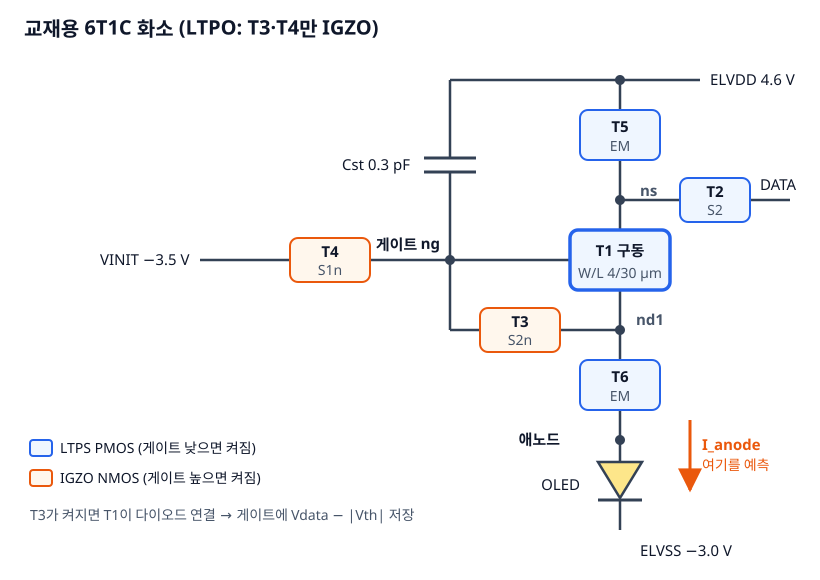
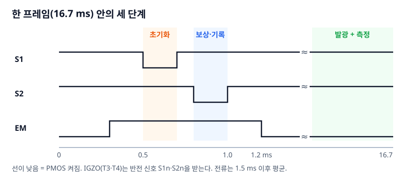
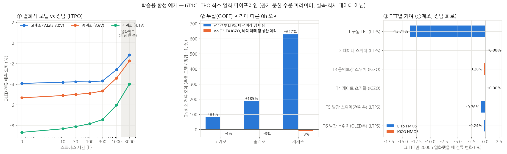

# 5장. 6T1C 화소 회로와 애노드 전류 — 어느 TFT가 전류를 가장 많이 깎나

`L3` · 60분 · 코드 `code/02_pipeline/pixel.py`, `run_pixels.py`, `grade.py`

---

## 한 문장

TFT 6개의 모델카드(시간별)를 6T1C 넷리스트에 넣고 **두 프레임 과도해석**을 돌려 발광 구간 평균 전류를 재면 시간별 애노드 전류가 나온다. 같은 회로에서 **TFT 하나만 늙혀 보면** 누가 전류를 깎는지 분리된다.

## 큰 그림





| 단계 | 켜지는 TFT | 일어나는 일 |
|---|---|---|
| 초기화 (0.5–0.7 ms) | T4 | 게이트 ng를 VINIT −3.5 V로 끌어내려 지난 프레임 기억을 지움 |
| 보상·기록 (0.8–1.0 ms) | T2, T3 | DATA가 T1 소스로 들어가고 T3가 T1을 다이오드로 묶음 → ng가 **Vdata − \|Vth,T1\|** 근처에서 멈춤 |
| 발광 (1.2 ms–) | T5, T6 | ELVDD → T5 → T1 → T6 → OLED. T1의 오버드라이브가 ELVDD − Vdata 로 정해져 **\|Vth\|가 식에서 빠짐** |

전류는 두 번째 프레임의 1.5 ms부터 끝 0.2 ms 전까지 평균(`meas tran iavg AVG i(Vsense)`)으로 잰다. 첫 프레임은 초기 조건 영향을 버리는 용도다.

## 비유: 키에 맞춰 조절되는 농구 골대

T1은 **키가 매년 줄어드는 선수**(|Vth|가 커짐), 전류는 **슛 성공률**이다.

- 2T1C는 골대 높이가 고정이다. 선수 키가 줄면 성공률이 바로 떨어진다 (2장).
- 6T1C의 보상·기록 단계는 **경기 전에 선수 키를 재서 골대를 그만큼 낮추는 것**이다. T3가 T1을 다이오드로 묶으면 게이트가 T1 자신의 문턱에서 멈추므로, 골대가 **선수 본인 키에 맞춰** 내려간다.
- 그래서 |Vth|가 0.86 V 늘어도 이론상 성공률은 그대로여야 한다.

## 그래서 뭐

### 결과 1: 시간별 애노드 전류 (정답 회로)

| 계조 (Vdata) | 0 h | 1000 h | 3000 h | 3000 h 유지율 |
|---|---|---|---|---|
| 고계조 (3.0 V) | 525.5 nA | 480.0 nA | 463.9 nA | 88.3% |
| 중계조 (3.6 V) | 237.3 nA | 211.4 nA | 202.5 nA | 85.3% |
| 저계조 (4.1 V) | 84.2 nA | 71.1 nA | 66.8 nA | 79.3% |

### 결과 2: 파이프라인 채점 (예측 / 정답 − 1)



| 방식 | 0 h 고/중/저 | 3000 h 고/중/저 (블라인드) |
|---|---|---|
| `cards` 시간별 추출 카드 (3000 h도 측정했다고 가정) | −4.4 / −5.8 / −9.0% | −2.6 / −3.1 / −5.3% |
| `law` 0 h 카드 + 열화식 (≤1000 h로 피팅) | −3.9 / −5.3 / −8.7% | **−1.2 / −1.7 / −4.0%** |

오차는 시간이 지나며 오히려 줄고, **저계조에서 가장 크다.** 오차의 주범은 열화식이 아니라 **피팅 모델의 정적 형태**(3장 표의 SIGMA·THETA 없음)다.

### 결과 3: 누가 전류를 깎나 (그림 ③, 그 TFT만 3000 h 열화)

| TFT | 스트레스 지수 (3장) | 중계조 전류 변화 | 저계조 |
|---|---|---|---|
| **T1 구동** | 0.34 | **−13.71%** | **−19.99%** |
| T5 발광(전원측) | 5.09 | −0.76% | −0.44% |
| T6 발광(OLED측) | 4.58 | −0.24% | −0.14% |
| T3 보상 (IGZO) | 0.05 | −0.20% | −0.33% |
| T2, T4 | 0.05 | 0.00% | 0.00% |

**가장 많이 늙는 T5·T6가 아니라 가장 덜 늙는 편인 T1이 전류를 지배한다.** T5·T6는 발광 중 선형영역 스위치라 |Vth|가 2 V 넘게 변해도 저항이 조금 늘 뿐이다. 측정 예산을 어디에 쓸지 이 표가 정한다.

## 비유가 깨지는 곳

1. **골대가 선수 키에 딱 맞춰 내려가지 않는다.** 보상이 완벽하면 T1 열화에 따른 전류 변화는 이동도 감소분(−3.5%)뿐이어야 하는데 실제는 −13.7%다. 게이트 전압을 보면:

   | 중계조 | 저장된 게이트 vg | 이상값 Vdata − \|Vth\| |
   |---|---|---|
   | 0 h | 2.369 V | 2.400 V |
   | 3000 h | 1.573 V | 1.543 V |
   | **변화** | **−0.796 V** | **−0.857 V** |

   게이트가 |Vth| 변화를 **61 mV 덜 따라갔다.** 오버드라이브가 약 1 V뿐이라 61 mV(약 6%)가 전류에서는 제곱 이상으로 커진다: 0.94^2.15 × 0.965 ≈ 0.85 → 약 −15% (어림셈, 실제 −13.7%). 저계조는 오버드라이브가 0.6 V 정도라 같은 60 mV가 더 아프다.
   원인 후보: 0.2 ms 기록 시간 안에 다이오드 연결 전류가 서브문턱으로 줄어 끝까지 못 따라감, 드레인 전압에 따른 문턱 이동(SIGMA), 스위칭 킥백. **분리는 연습문제 2.**
2. **선수가 한 명씩만 늙지 않는다.** 표 3은 한 TFT만 늙힌 결과라 합이 전체 변화와 같지 않다(상호작용). 정답 회로 전체 열화는 중계조 −14.7%, 개별 합은 −14.9%로 이 예제에서는 거의 더해지지만 항상 그렇다는 보장은 없다.
3. **스트레스를 고정했다.** 실제로는 계조(Vdata)에 따라 T1의 |Vgs|와 duty가 달라져 열화 속도가 달라진다. 이 예제는 모든 계조가 같은 열화 이력을 가진다고 가정했다.

---

## 직접 해보기

```bash
cd code/02_pipeline
python run_pixels.py     # 189개 시뮬레이션 (3계조 × 7시간 × [truth, cards, law, T1..T6 민감도])
python grade.py          # figs/pipeline_grade.png
```

### 넷리스트 핵심 (`pixel.py`가 만든 `runs/pix/*/run.cir`)

```spice
NT1 nd1 ng ns mT1               ; 구동 (d g s)
NT2 ns s2 data mT2              ; 데이터 스위치, PMOS → s2 (active-low)
NT3 nd1 s2n ng mT3              ; 보상 스위치, IGZO NMOS → s2n (active-high 반전 신호)
NT4 vinit s1n ng mT4            ; 게이트 초기화, IGZO → s1n
NT5 ns em elvdd mT5
NT6 nan em nd1 mT6
Cst elvdd ng 0.3p
Vsense nan no 0                 ; 0 V 전압원 = 전류계
Doled no elvss oled
.control
set num_threads=1               ; ← 빼면 병렬 실행 시 수천 배 느려진다
pre_osdi .../ptft_fit.osdi
tran 5u 0.033334 0 5u
meas tran iavg AVG i(Vsense) from=0.018167 to=0.033134   ; 둘째 프레임 발광 구간 평균
.endc
```

### 시간은 `.model` 줄의 `TSTRESS`로

```spice
.model mT1 ptft_fit W=4e-06 L=3e-05 POL=1 VT0=1.14577 U0=71.1498 GAMMA=0.0355 SS=0.2660 LAMBDA=0.0554
+ GOFF=2.573e-13 AVT=1.1083 TAUV=1370.6 BETAV=0.4575 AMU=0.02175 TAUM=216.5 BETAM=0.9974 TSTRESS=3000
```

`law` 방식은 모든 시간에서 같은 카드를 쓰고 `TSTRESS`만 바꾼다. 즉 **열화식이 Verilog-A 안에 들어가 있다.** `cards` 방식은 시간마다 추출한 카드를 `TSTRESS` 없이 그대로 넣는다.

### 이 장에서 실제로 밟은 함정

| 증상 | 원인 | 해결 |
|---|---|---|
| 14개 병렬 실행이 4시간 | ngspice 기본 `spinit`이 `num_threads=8` → 16코어에 112 스레드 | `.control`에 `set num_threads=1`, 환경변수 `OMP_NUM_THREADS=1` → 2초 |
| 서브문턱 pA 전류가 부정확 | 기본 `abstol` = 1 pA | `.options abstol=1e-16 reltol=1e-6 vntol=1e-9` |
| IGZO 스위치가 안 켜짐 | NMOS인데 PMOS용 active-low 스캔을 연결 | 반전 신호 `s1n`, `s2n` 추가, 모델은 `POL=−1` |
| 저계조 전류 7배 틀림 | 측정 바닥 아래 점 삭제 → GOFF 발산 → hold 중 게이트 방전 | 3장 상한 처리 |

---

## 연습문제

1. `pixel.py`의 `probe=True` 옵션으로 한 번 돌려 `probe.txt`에서 v(ng)를 그려라. 초기화 → 기록 → hold 동안 게이트가 어떻게 움직이는지 표의 세 단계와 맞춰보라.
2. 기록 시간(`Vs2`와 `Vs2n`의 펄스 폭 0.2 ms)을 0.3 ms, 0.35 ms로 늘리고 (발광이 1.2 ms에 켜지므로 그 전에 끝나야 한다. 더 늘리려면 `Vem`도 같이 옮긴다) T1만 3000 h 늙힌 전류 변화(−13.7%)가 줄어드는지 보라. 줄어든다면 61 mV 보상 부족의 주원인은 무엇이었나?
3. `ROLES`의 T1 `L`을 30 µm → 10 µm로 줄이면 전류와 T1 민감도가 어떻게 바뀌는가? 이유를 오버드라이브로 설명하라.

> **적용 질문**
> 연구실 측정 시간이 TFT 두 개분밖에 없다. 이 장의 결과만 근거로 한다면 어떤 두 개를 재겠는가? 여러분 실제 화소에서도 같은 선택이 옳은지 확인하려면 무엇을 먼저 돌려봐야 하는가?

[← 4장](ch04_aging_law.md) · [다음: 6장 기존 흐름 vs AI vs Hybrid →](ch06_ml_vs_physics.md)
