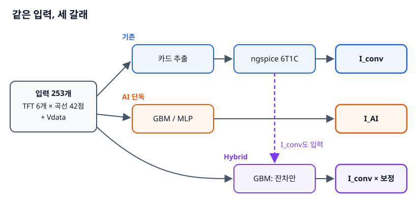
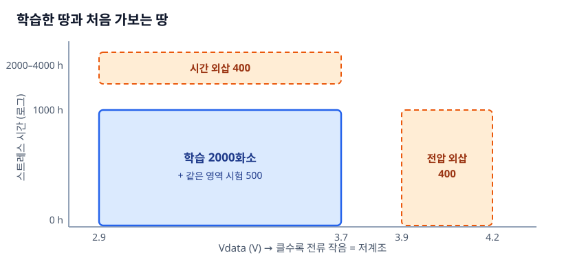
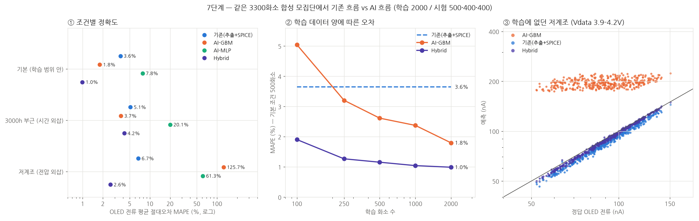

# 6장. 기존 흐름 vs AI vs Hybrid — AI는 어디서 이기고 어디서 무너지나

`L3` · 60분 · 코드 `code/02_pipeline/gen_dataset.py`, `ml_compare.py`, `ml_grade.py`

---

## 한 문장

같은 3300개 합성 화소로 비교하면, AI 단독은 **학습 범위 안에서는 기존 물리 흐름보다 정확했지만 처음 보는 계조에서 오차 126%로 무너졌고**, 기존 흐름의 결과에 **남은 오차만 AI로 보정한 Hybrid**가 세 조건 모두에서 가장 안정적이었다.

## 큰 그림





| 방법 (평균 오차 MAPE / 상위 5% 오차 P95) | 기본 (학습 범위 안) | 3000 h 부근 (시간 외삽) | 저계조 (전압 외삽) |
|---|---|---|---|
| 기존 (추출 + SPICE) | 3.6% / 8% | 5.1% / 29% | 6.7% / 11% |
| AI-GBM | 1.8% / 5% | 3.7% / 11% | **125.7% / 218%** |
| AI-MLP | 7.8% / 19% | 20.1% / 80% | 61.3% / 111% |
| **Hybrid** | **1.0% / 2%** | 4.2% / 27% | **2.6% / 5%** |



## 데이터는 어떻게 만들었나

| 항목 | 내용 |
|---|---|
| 화소 1개 | TFT 6개 각자 VT0·U0·SS·GOFF 산포 + 화소별 사용량 계수(로그정규, 열화 속도를 곱함) + 스트레스 시간 + Vdata |
| 입력 X (253개) | TFT 6개 × transfer 곡선 21점(\|Vgs\| 0–8 V) × \|Vds\| 2개(0.1, 5 V)의 log 전류 + Vdata. **3% 잡음 포함** |
| 정답 y | 정답 모델로 돌린 6T1C 애노드 전류 |
| 기존 흐름 | 같은 잡음 곡선에서 TFT별 카드 추출(3장 방식) → `ptft_fit` 6T1C |
| 분할 | main 2500 (t ≤ 1000 h, Vdata 2.9–3.7 V) → 학습 2000 / 시험 500 · blind_time 400 (2000–4000 h) · unseen_gray 400 (Vdata 3.9–4.2 V) |

모델:

- **AI-GBM**: `HistGradientBoostingRegressor` (트리 600개), X → log I
- **AI-MLP**: 은닉층 128·64, 표준화, X → log I
- **Hybrid**: GBM이 `log(I_정답 / I_기존)`, 즉 **기존 흐름의 잔차만** 학습. 입력에 `log I_기존`도 넣는다. 예측 = I_기존 × 10^(보정)

## 비유: 내비게이션과 동네 택시기사

- **기존 흐름 = 내비게이션.** 지도(물리 모델)로 계산한다. 어느 동네든 그럭저럭 맞지만, 지도에 없는 골목 사정(모델이 모르는 효과)만큼 늘 조금씩 틀린다.
- **AI 단독 = 20년 한 동네만 달린 택시기사.** 그 동네에선 내비보다 빠르다. 그런데 **처음 가는 동네에 내려놓으면 아는 길 중 제일 비슷한 곳으로 간다.** 저계조 400개 화소 전부에 약 180–215 nA를 답한 것이 그 장면이다 (정답 50–150 nA).
- **Hybrid = 내비를 켜고 운전하는 동네 기사.** 경로는 내비가 정하고, 기사는 "이 교차로는 내비보다 2분 더 걸린다"는 **보정만** 한다. 처음 가는 동네에서도 내비가 기본을 잡아주니 크게 틀리지 않는다.

## 그래서 뭐

1. **"AI가 기존보다 정확하다"는 문장은 시험 조건 없이는 의미가 없다.** 같은 GBM이 1.8%이기도 하고 126%이기도 하다. 보고할 때는 반드시 **학습 범위 안 / 시간 외삽 / 조건 외삽**을 나눠 적는다.
2. **트리 모델은 학습 범위 밖에서 상수가 된다.** GBM은 입력 공간을 칸으로 나눠 칸마다 값을 외운다. Vdata 3.7 V 너머에는 칸이 없으니 3.7 V 근처 값을 그대로 낸다. 이건 튜닝 문제가 아니라 **구조**다.
3. **Hybrid의 데이터 효율.** 학습 화소 100개일 때 Hybrid 1.9%, GBM 5.0%, 기존 3.6%. 기존 흐름이 이미 큰 그림을 맞췄으므로 AI가 배울 것(잔차)이 작고 매끄럽다. **실측 화소 데이터가 비싼 상황**에서 결정적이다.
4. **산포(σ/평균)는 모두 비슷했다** (정답 28.9%, 기존 29.8%, GBM 28.8%, Hybrid 29.0%, 0 h 시험 화소 88개). 평균 오차와 모집단 산포 재현은 다른 질문이다.

## 비유가 깨지는 곳 — 특히 중요

1. **이 AI는 미래를 예측하지 않는다.** 입력은 "**그 시점에 잰** TFT 곡선"이고 시간은 입력에 없다. "3000 h 부근" 시험은 3000 h에 실제로 잰 곡선을 주고 그 순간 전류를 맞히는 문제다. **측정하지 않은 미래 시간의 전류**를 원하면 4장 열화식으로 미래 곡선(또는 카드)을 먼저 만들고 그걸 넣어야 한다. 이 경우 오차는 열화식 외삽 오차 + 이 장의 오차로 쌓인다.
2. **GBM이 시간 외삽(3.7%)에서 버틴 건 운이 좋았던 것에 가깝다.** 화소마다 사용량 계수가 달라서, 많이 쓴 화소의 1000 h 곡선이 평균 화소의 3000 h 곡선과 닮았다. 입력 곡선 모양이 이미 본 범위 안에 있었기 때문이다. 사용량 산포가 작은 실측에서는 그렇지 않을 수 있다.
3. **Hybrid의 꼬리는 기존 흐름에서 물려받는다.** 시간 외삽 P95가 기존 29% → Hybrid 27%로 거의 그대로다. 기존 추출이 크게 실패한 화소는 보정으로도 못 살린다. 내비가 길을 완전히 잘못 잡으면 기사도 못 돌린다.
4. **MLP가 나쁜 이유를 "신경망은 안 된다"로 읽으면 안 된다.** 2000개 표본에 253차원 입력, 구조·정규화를 거의 튜닝하지 않았다. 이 표는 **이 설정에서의 결과**다.
5. **시드 1개, 합성 모집단 1개.** 차이가 1%p 이내인 비교(예: 시간 외삽의 GBM 3.7% vs Hybrid 4.2%)는 순위를 주장할 근거가 못 된다.

---

## 직접 해보기

```bash
cd code/02_pipeline
python ml_compare.py    # 저장소의 data/dataset.npz로 바로 실행 (수십 초)
python ml_grade.py      # figs/ml_compare.png
# python gen_dataset.py # 모집단을 새로 만들기: 화소 3300개 × 회로 2개. 파이프라인에서 가장 오래 걸린다
```

### Hybrid 핵심 코드

```python
Xh = np.column_stack([X, lc])                       # lc = log10(I_기존)
hybrid = gbm().fit(Xh[train], ly[train] - lc[train])  # 잔차만 학습
pred_log = lc[test] + hybrid.predict(Xh[test])      # 기존 + 보정
```

세 줄이다. **어려운 건 코드가 아니라 `lc`(기존 흐름 결과)를 화소마다 준비하는 것**이다. 그게 3–5장 전체다.

### 오차는 원래 단위로

```python
def err(pred_log, i): return np.abs(10 ** (pred_log - ly[i]) - 1) * 100   # %
```

log 공간 RMSE로 보고하면 저전류 화소 오차가 과소평가되기 쉽다. 논문·보고서에는 **원래 단위의 상대오차와 P95**를 같이 쓴다.

---

## 연습문제

1. Hybrid 입력에서 `lc`를 빼고 X만 쓰면 결과가 어떻게 바뀌는가? 잔차 학습의 이득이 "목표가 작아서"인지 "입력 정보가 늘어서"인지 가려보라.
2. `TRAIN`을 main에서만 뽑지 말고 unseen_gray 화소 20개를 섞어 학습하면 AI-GBM의 저계조 오차는 얼마가 되는가? **외삽 조건 데이터 몇 개의 가치**를 숫자로 말해보라.
3. 입력에 스트레스 시간 `t`를 추가하면 시간 외삽 성능이 좋아질까 나빠질까? 예상을 먼저 적고 돌려보라.
4. `random_state`와 `gen_dataset.py`의 시드를 3개씩 바꿔 표를 다시 만들고, 각 칸을 평균 ± 표준편차로 적어라.

> **적용 질문**
> 연구실에서 "RF로 애노드 전류를 R² 0.98로 예측했다"는 결과가 나왔다. 이게 **새 소자·새 계조·더 긴 시간**에서도 통한다고 말하려면 검증 데이터를 어떻게 나눠야 했는가? (7장에서 누수 문제와 함께 다룬다)

[← 5장](ch05_pixel_6t1c.md) · [다음: 7장 실측 데이터와 8T1C로 옮기기 →](ch07_real_data_8t1c.md)
