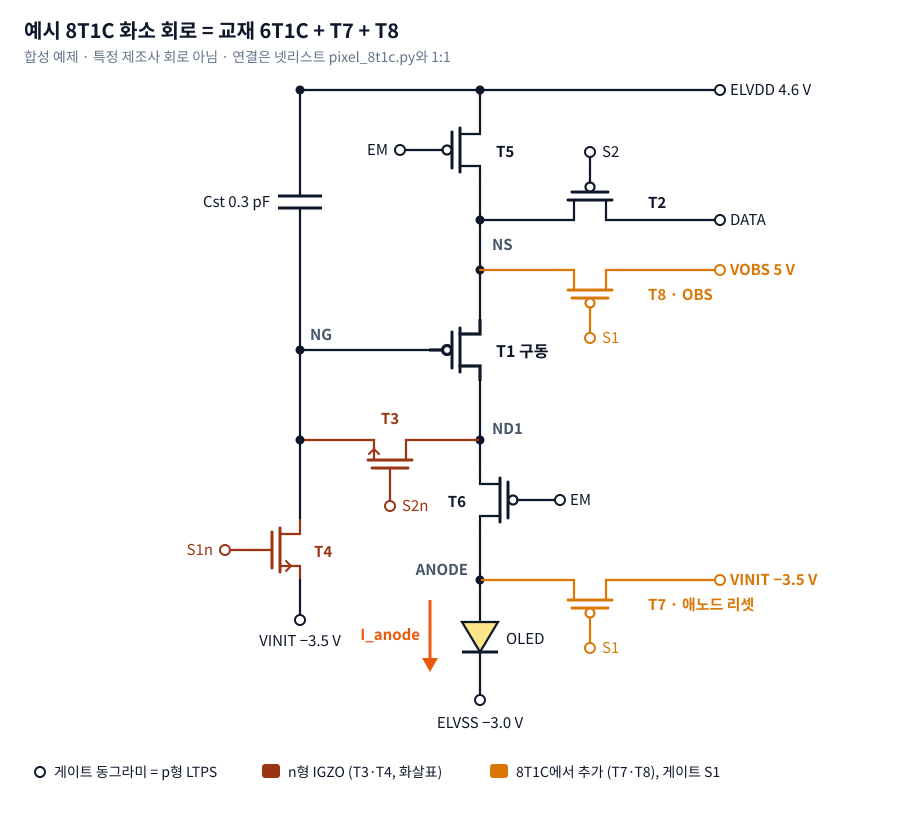
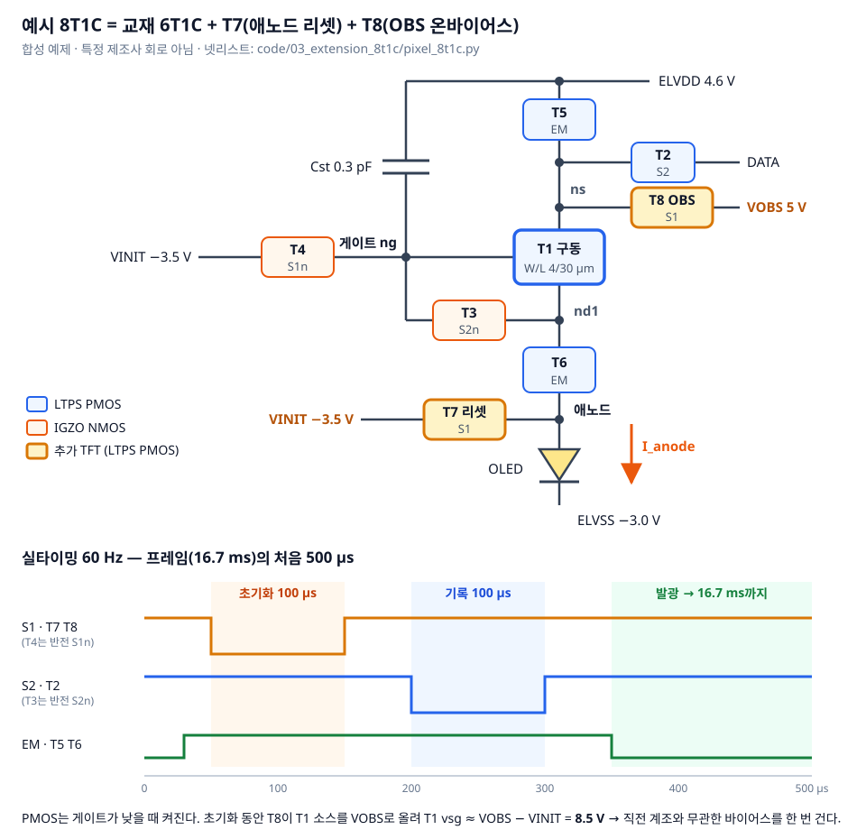
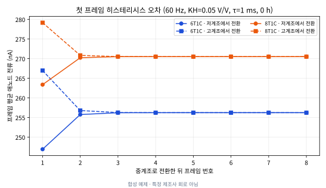
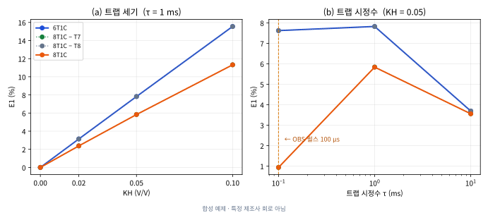

# 9장. 8T1C 히스테리시스와 프레임 응답 — T8이 막으려는 현상을 넣으면 달라지나

`L3` · 60분 · 코드 `code/04_hysteresis_8t1c/run_hysteresis.py`

---

## 한 문장

7장에서 T7·T8을 붙여도 결과가 같았던 이유는 **모델에 히스테리시스가 없고 지표가 정상상태 평균뿐**이었기 때문이다. TFT 모델에 트랩 상태 하나를 넣고 지표를 **계조 전환 직후 첫 프레임**으로 바꾸자, T8(OBS)은 첫 프레임 오차를 **25% 줄였다.** 그러나 그 효과는 **트랩 시정수가 OBS 펄스 길이와 비슷할 때만** 컸고, 정상상태 수명(유지율)에는 이득이 없었다.

---

## 큰 그림



회로도는 `code/04_hysteresis_8t1c/draw_schematic.py`가 넷리스트 연결을 그대로 옮겨 그린다. 아래는 같은 회로를 기능 블록으로 다시 그리고 60 Hz 한 프레임의 앞 500 µs 구동 파형을 붙인 것이다.



7장 결론에서 바꾼 것은 두 가지다.

| | 7장 | 9장 |
|---|---|---|
| TFT 모델 | `ptft_true.va` — 과거 바이어스를 기억하지 않음 | `ptft_hyst.va` — 트랩 상태 1개가 과거 vsg를 기억 |
| 타이밍 | 가속 1 ms 프레임 | **실타이밍 60 Hz** (16.667 ms) + 비교용 가속 1 ms |
| 지표 | 2프레임째 발광 평균 전류 | 계조 전환 후 **프레임 1…8 각각의** 평균 전류 → E1, N_settle, R_ss |
| T7·T8 스트레스 | duty 0.012, \|Vgs\| 10 V **가정** | 회로 파형에서 **측정** |

### ① 트랩 상태 하나 넣기

```verilog
electrical d, g, s, mem;                  // mem: 내부 노드 (단자 아님)
I(mem) <+ V(mem) - vsg;
I(mem) <+ ddt(TAUH * V(mem));             // TAUH·dV(mem)/dt = vsg − V(mem)  → 1차 저역통과
vth = VT0 + (열화) - SIGMA*vsd + KH * (V(mem) - VREFH);
```

- `V(mem)`은 vsg를 시정수 τ(`TAUH`)로 따라가는 **느린 복사본**이다.
- 과거에 vsg가 컸으면 `V(mem)`이 크고 → |Vth|가 `KH`배만큼 커진다 (LTPS PMOS의 음바이어스 스트레스 방향).
- `KH = 0`이면 7장 모델과 **똑같아야 한다.** 이것이 첫 번째 게이트다.

Verilog-A에서 "상태 변수"를 만들 때 내부 노드 + `ddt`를 쓰는 이유: 시뮬레이터가 이 노드를 회로 방정식의 일부로 풀기 때문에 시간 간격 제어·수렴 판정이 자동으로 따라온다. `real` 변수에 이전 값을 저장하는 방식은 뉴턴 반복·시간 되돌리기에서 깨진다.

### ② 프레임 단위 지표

```
시나리오: 4프레임 동안 저계조(Vdata 4.1 V) 또는 고계조(3.0 V) → 중계조(3.6 V)로 전환 → 8프레임 관찰

E1       = |I₁(저계조에서 전환) − I₁(고계조에서 전환)| / I_ss        첫 프레임 히스테리시스 오차
N_settle = 전류가 I_ss ±1% 안에 처음 들어오는 프레임 번호
R_ss     = I_ss(열화 t) / I_ss(0 h)                                  7장 유지율과 같은 뜻
I_ss     = 프레임 7·8 평균
```

같은 중계조를 보여줘야 하는데 **직전에 무엇을 보여줬느냐에 따라** 첫 프레임 밝기가 다르면, 화면에서는 잔상·계조 오차로 보인다. E1이 그 크기다.

---

## 게이트 — 결과를 보기 전에 통과해야 하는 것

| 게이트 | 무엇을 | 기준 | 결과 |
|---|---|---|---|
| G1 대조군 | KH = 0에서 6T1C·8T1C, 0 h·3000 h 전류가 7장 `results_8t1c.csv`와 같은가 | 상대오차 ≤ 1e-4 | 최대 5.9e-6 **PASS** |
| G2 시정수 | vsg 1 V 계단에서 1τ 뒤 V(mem) | 63.2 ± 2% | 63.20% **PASS** |
| G3 시간 간격 | 최대 간격 20 µs vs 2 µs에서 I_ss·E1 | I_ss ≤ 0.5%, E1 ≤ 5% | I_ss 0.024%, E1 0.012% **PASS** |

G3이 중요한 이유: 60 Hz에서 기록 구간은 100 µs뿐이다. 최대 간격 20 µs면 기록 구간에 점이 5개다. 결과 차이가 **회로 효과인지 수치 오차인지** 먼저 가르지 않으면 아래 표는 의미가 없다.

전체 72회 시뮬레이션, 16코어에서 약 11초. 두 번 돌려 결과 CSV와 그림이 **바이트 단위로 같음**을 확인했다.

---

## 결과 1 — 첫 프레임에서 벌어지고, 2프레임이면 닫힌다



대표 조건: 60 Hz, KH = 0.05 V/V, τ = 1 ms, 0 h, VOBS = 5 V (`frame_currents.csv`)

| 회로 · 출발 계조 | 프레임 1 | 프레임 2 | 프레임 3 | I_ss |
|---|---|---|---|---|
| 6T1C · 저계조에서 | 246.92 nA | 255.76 | 256.22 | 256.24 |
| 6T1C · 고계조에서 | 266.97 nA | 256.78 | 256.27 | 256.24 |
| 8T1C · 저계조에서 | 263.38 nA | 270.24 | 270.51 | 270.51 |
| 8T1C · 고계조에서 | 279.17 nA | 270.84 | 270.52 | 270.51 |
| **E1** | **6T1C 7.82% → 8T1C 5.84%** (−25.4%) | | | |

- 저계조(Vdata 높음 → T1 vsg 작음)에서 온 화소는 트랩이 덜 차 있어 |Vth|가 작다… 여야 할 것 같지만, 기록 순간의 |Vth|가 보상으로 저장되고 발광 중 트랩이 풀리며 **보상값과 실제 |Vth|가 어긋나는 방향**이 결과를 정한다. 방향을 직관으로 맞히기 어렵다는 것 자체가 시뮬레이션이 필요한 이유다.
- **KH = 0이면 E1 = 0.001%**다. 첫 프레임 차이는 전부 트랩 상태에서 왔다.
- 모든 조건에서 N_settle ≤ 2였다. τ를 최대 10 ms까지만 봤기 때문이다 (한계 3).

## 결과 2 — 효과는 전부 T8에서, 크기는 τ가 정한다



E1 (%) · 60 Hz · 0 h (`metrics.csv`)

| τ | 6T1C | 8T1C | 8T1C − T7 | 8T1C − T8 | 8T1C 감소율 |
|---|---|---|---|---|---|
| 0.1 ms | 7.62 | **0.93** | 0.93 | 7.62 | **−88%** |
| 1 ms | 7.82 | 5.84 | 5.84 | 7.82 | −25% |
| 10 ms | 3.69 | 3.55 | 3.56 | 3.69 | −4% |

| KH (τ = 1 ms) | 0 | 0.02 | 0.05 | 0.10 |
|---|---|---|---|---|
| 6T1C | 0.00 | 3.14 | 7.82 | 15.55 |
| 8T1C | 0.00 | 2.38 | 5.84 | 11.32 |

1. **T7을 빼도 8T1C와 같고, T8을 빼면 6T1C와 같다.** 이 모델에서 첫 프레임 오차를 줄이는 것은 전적으로 T8(OBS)이다. T7(애노드 리셋)이 막는 OLED 잔류 전하는 이 OLED 모델(다이오드 + 0.3 pF)로는 거의 드러나지 않는다.
2. **OBS 펄스는 100 µs다.** τ가 그와 비슷하면(0.1 ms) 한 번의 OBS로 트랩이 거의 같은 상태로 리셋돼 이전 계조 기억이 지워진다. τ가 10배 길면(1 ms) 일부만, 100배 길면(10 ms) 거의 못 지운다. **OBS의 효과는 회로가 아니라 회로 × 소자 트랩 시정수의 조합**이다.
3. VOBS 4 / 5 / 6 V에서 E1 = 5.86 / 5.84 / 5.81%로 거의 같았다. E1은 두 이력의 **차이**라서, 공통으로 더해지는 바이어스 크기보다 **리셋 시간 대비 τ**가 지배한다.

## 결과 3 — 수명(유지율)에는 이득이 없고, 정상 전류는 바뀐다

R_ss (%) · KH = 0.05, τ = 1 ms

| 열화 | 6T1C | 8T1C |
|---|---|---|
| 1000 h | 88.99 | 88.62 |
| 3000 h | 85.22 | 84.73 |

- **3000 h 유지율은 8T1C가 0.5%p 낮다.** OBS는 잔상용이지 수명용이 아니다. "8T1C로 바꾸면 수명이 늘어나나"에 대한 이 모델의 답은 **아니오**다 (시드 1개, 차이 0.5%p라 "나빠진다"고 주장할 근거도 약하다).
- 0 h 정상 전류가 6T1C 256.2 nA → 8T1C 270.5 nA로 **+5.6%** 달라졌다 (KH = 0이면 둘 다 258.5 nA). OBS가 기록 직전 트랩 상태를 바꾸므로 **보상 회로가 저장하는 |Vth|도 바뀐다.** 실제 패널이라면 감마 보정값이 OBS 조건에 따라 달라진다는 뜻이다.

## 결과 4 — 가속 타이밍은 히스테리시스를 숨긴다

| 타이밍 (KH = 0.05, τ = 1 ms) | 6T1C E1 | 8T1C E1 |
|---|---|---|
| 실타이밍 60 Hz | 7.82% | 5.84% |
| 가속 1 ms 프레임 | **2.13%** | 0.75% |

가속 프레임(1 ms)은 τ = 1 ms와 길이가 같아서, 트랩이 한 프레임 안에 반쯤 평균된다. **6T1C 오차가 실제의 약 1/4로 보였다.** 계산 시간을 줄이려고 프레임을 줄이면, 시정수가 프레임과 비슷한 현상은 사라진다. (주의: 가속 케이스는 초기화·기록 폭도 200 µs로 달라서 순수한 프레임 길이만의 비교는 아니다.)

## 결과 5 — T7·T8 스트레스는 가정보다 훨씬 작았다

`stress_probe.csv` — 60 Hz 파형에서 시간 가중으로 측정

| | 가정 (7장) | 측정 | 스트레스 지수 duty·(\|Vgs\|/5)² |
|---|---|---|---|
| duty | 0.012 | **0.0061** (= 100 µs / 16.667 ms) | |
| T7 \|Vgs\| | 10 V | **3.49 V** | 0.048 → **0.0030** (1/16) |
| T8 \|Vgs\| | 10 V | **11.96 V** | 0.048 → **0.035** |

T7은 게이트가 −7 V일 때 소스(애노드)가 이미 VINIT 근처(−3.5 V)로 끌려가 있어 \|Vgs\|가 작다. **스트레스는 넷리스트를 한 번 돌려 파형에서 읽어야** 한다 — 5장 "비유가 깨지는 곳 3"을 실제로 해본 결과다.

> **에이전트가 만든 함정 (8장 연결)**
> 이 장의 첫 코드는 AI 코딩 에이전트가 썼다. duty를 `(S1<0인 점 개수) / (전체 점 개수)`로 셌고 **0.082**가 나왔다. ngspice는 스위칭 에지 근처에 시간점을 촘촘히 찍으므로 점 개수는 시간에 비례하지 않는다. 시간 가중(`np.trapezoid`)으로 바꾸자 0.0061 — **13.5배 과대**였다. 같은 코드에서 측정한 T7·T8 파라미터를 만들어 놓고 회로 카드에는 **옛 값을 넣는** 버그도 있었다. 둘 다 에러 없이 그럴듯한 숫자를 냈다. "측정값 = 100 µs / 16.667 ms"처럼 **손으로 검산 가능한 값과 비교**하는 습관이 잡아냈다.

---

## 비유: 문을 열기 전에 방을 환기하기

T1의 트랩은 **방에 남은 냄새**, 계조 전환은 **다른 손님이 방에 들어오는 것**이다.

- 6T1C: 이전 손님이 남긴 냄새(직전 계조의 바이어스 이력)가 남은 채로 다음 손님이 들어온다 → 첫인상(첫 프레임)이 이전 손님에 따라 다르다.
- 8T1C의 T8: 손님을 받기 직전 **창문을 100 µs 동안 활짝 연다** (강한 온바이어스 8.5 V). 누가 있었든 비슷한 공기로 만든 뒤 손님을 들인다.
- 냄새가 금방 빠지는 종류(τ ≈ 0.1 ms)면 잠깐의 환기로 충분하다 → E1 −88%. 벽지에 밴 냄새(τ = 10 ms)는 100 µs 환기로 안 빠진다 → −4%.
- 환기는 **첫인상**을 고르게 할 뿐, 방이 낡는 속도(열화·수명)를 늦추지는 않는다.

## 비유가 깨지는 곳

1. **환기는 공기를 "원래 상태"로 되돌리지만 OBS는 트랩을 "강한 스트레스 상태"로 민다.** 그래서 정상 전류 자체가 +5.6% 바뀌었다. 창문을 열었더니 방 온도가 바뀐 셈이고, 이건 보정해야 할 새 오프셋이다.
2. **냄새는 한 종류가 아니다.** 실제 트랩은 µs부터 수 시간까지 시정수가 넓게 퍼져 있다. 이 모델은 τ 하나뿐이라 "어느 τ에서 얼마"를 따로따로 보여줄 뿐, 실제 소자에서 합쳐진 효과는 τ 분포를 측정해야 알 수 있다 (10장 D절).
3. **환기가 방을 망가뜨릴 수 있다.** T8 자신도 \|Vgs\| ≈ 12 V 스트레스를 받고, 강한 OBS는 T1에 추가 스트레스가 된다. 이 모델에서 OBS가 T1 열화 속도에 주는 되먹임은 넣지 않았다 (열화 이력은 고정).

## 그래서 뭐

1. **"8T1C가 6T1C보다 좋은가"는 지표를 정하기 전에는 답이 없는 질문이다.** 정상상태 유지율로는 차이 없음, 첫 프레임 오차로는 최대 −88%, 정상 전류 오프셋은 +5.6%. 교수님께 보고할 때는 세 지표를 **따로** 적는다.
2. **OBS 효과를 예측하려면 소자 측정에서 τ를 먼저 받아야 한다.** 회로 시뮬레이션만으로는 −4%인지 −88%인지 정할 수 없다. 이게 10장에서 측정팀에 read 지연부터 묻는 이유다.
3. **계산 시간을 줄이는 가속 타이밍은 시정수가 프레임과 겹치는 현상을 숨긴다.** 가속으로 경향을 보더라도 결론은 실타이밍으로 한 번 확인한다.
4. **TFT를 추가할 때 "빼면 무엇이 나빠지나"를 제거 실험으로 확인한다.** T7 제거 = 변화 없음은 "T7이 쓸모없다"가 아니라 "T7이 막는 현상이 이 모델에 없다"는 뜻이다 (7장과 같은 논리).

## 한계

1. 트랩 상태 1개, 1차 선형, **충전·방전 시정수 동일.** 실제 NBTS 회복은 충전보다 훨씬 느리고 비대칭이다.
2. KH가 모든 TFT에 같은 값으로 들어갔다. 실제로는 LTPS·IGZO, 구동·스위치별로 다르다.
3. τ ≤ 10 ms만 봤다. τ ≥ 1 프레임(수십 ms~초)이면 N_settle이 여러 프레임으로 늘어날 것이다 — 연습문제 1.
4. OLED는 다이오드 + 0.3 pF. 실제 OLED 용량·잔류 전하가 크면 T7의 효과가 드러날 수 있다 — 연습문제 2.
5. 시드 1개, 파라미터 세트 1개. 0.5%p 차이로 순위를 주장하지 않는다.

---

## 직접 해보기

```bash
cd code/04_hysteresis_8t1c
python run_hysteresis.py      # 모델 컴파일 → 게이트 G1·G2·G3 → 72회 시뮬레이션 → CSV·그림 (약 11초)
cat results/summary.md
```

게이트 하나라도 실패하면 스크립트가 시뮬레이션 전에 멈춘다.

## 연습문제

1. `matrix()`의 τ 목록에 `0.05, 0.2` (s)를 더해 돌려라. N_settle이 몇 프레임까지 늘어나는가? 그때 8T1C의 E1 감소율은?
2. `netlist()`의 OLED 모델에서 `CJO=0.3p`를 `3p`, `30p`로 바꿔 보라. 8T1C − T7 회로와 8T1C의 E1이 갈라지기 시작하는 용량은?
3. OBS 펄스 폭(`init_width`)을 50 / 100 / 200 / 400 µs로 바꾸고 τ = 1 ms에서 E1을 그려라. "펄스 폭 / τ"로 x축을 정규화하면 τ = 0.1 ms 결과와 한 곡선에 올라가는가? 올라가지 않는다면 이유는?
4. 모델에 충전·방전 시정수를 따로 두는 `TAUH_UP`, `TAUH_DN`을 추가하라 (힌트: `vsg > V(mem)`인지에 따라 `ddt` 계수를 바꾼다. 불연속 전환이 수렴을 해치지 않게 부드러운 함수로). G1·G2를 새로 설계해야 하는가?

> **적용 질문**
> 공동연구 측정팀이 "우리 LTPS의 NBTS 회복 시정수는 1초~100초에 퍼져 있다"고 했다. 이 장의 결과로 볼 때, 8T1C의 OBS가 잔상을 줄일 것이라고 말할 수 있는가? 말할 수 없다면 어떤 측정·시뮬레이션을 추가로 요구하겠는가?

[← 8장](ch08_ai_agents.md) · [다음: 10장 공동연구로 옮기기 →](ch10_collab_snu.md)
