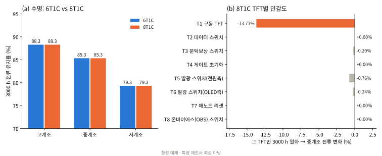
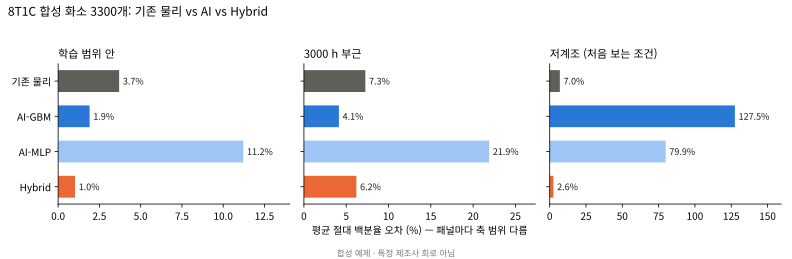

# 11장. 8T1C 전체 파이프라인 — 6T1C와 같은 절차를 끝까지 적용하면 무엇이 달라지나

`L3` · 60분 · 코드 `code/05_full_8t1c/pipeline8.py`

---

## 한 문장

예시 8T1C에 3~6장과 **똑같은 절차**(측정 → 모델카드 추출 → 열화식 → 화소 채점 → TFT별 민감도 → AI 비교)를 8개 TFT 전부에 적용했더니, **수명·예측 오차·민감도·AI 결론이 6T1C와 같았다.** 8T1C의 차이는 정상상태 지표가 아니라 계조 전환 직후 프레임(9장)에서만 나타난다. 다만 추출할 TFT가 늘어난 만큼 **시간 외삽에서 기존 물리 흐름의 꼬리 오차가 커졌다.**

---

## 큰 그림


| 단계 | 6T1C (3~6장) | 8T1C (이 장) | 산출물 `code/05_full_8t1c/` |
|---|---|---|---|
| 스트레스 조건 | TFT별 duty·\|Vgs\| 설정 | T7·T8은 **60 Hz 파형에서 측정** | `results/stress_probe.csv` |
| ① 측정 | T1~T6 합성 I–V | T1~T6 **재사용** + T7·T8 신규 | `data/measured_iv_t78.csv` |
| ② 추출 | 시간별 모델카드 | T7·T8 추출 (같은 목적함수·상한 처리) | `cards/extracted_cards_8t1c.json` |
| ③ 열화식 | stretched exponential, ≤1000 h 피팅 | T7·T8 동일 | `cards/aging_law_8t1c.json`, `results/aging_t78.csv` |
| ④⑤ 화소 채점 | 정답 / 추출 카드 / 열화식 × 3계조 × 7시점 | 8T1C 동일 | `results/grade_6t1c_vs_8t1c.csv` |
| 민감도 | 6개 TFT | **8개 TFT** × 3계조 | `results/sensitivity_8t1c.csv` |
| AI 비교 | 합성 화소 3300개 | 8T1C 화소 3300개 (입력 8 TFT × 42점 + Vdata = 337차원) | `results/ml_8t1c.csv` |

T1~T6의 측정·추출 결과를 재사용한 이유: 같은 소자를 다시 "측정"하면 잡음 난수가 달라져 6T1C와 8T1C의 차이가 회로 때문인지 잡음 때문인지 섞인다. **바뀐 것은 T7·T8과 회로뿐**이 되도록 설계했다.

---

## 게이트

| 게이트 | 무엇을 | 결과 |
|---|---|---|
| P1 | 파형에서 잰 S1 on 시간 = 200 µs + 에지 절반 (duty 0.0126) | 오차 0.17% **PASS** |
| E1 | 이 장의 추출기가 3장의 T1 0 h 카드(VT0, U0)를 그대로 재현 | 오차 0 **PASS** |
| N1 | 8T1C 넷리스트 텍스트가 7장과 완전히 동일 | **PASS** |
| N2 | 0 h 정답 전류(3계조)가 7장 결과와 동일 | 오차 0 **PASS** |
| D1 | 모집단 3300개 중 시뮬레이션 실패 화소 비율 ≤ 1% | 0% **PASS** |

전체 단계를 두 번 실행해 데이터·카드·결과·그림이 **바이트 단위로 같음**을 확인했다. 16코어에서 모집단 포함 약 3분.

---

## 결과 1 — T7·T8 스트레스: duty 가정은 맞고 \|Vgs\| 가정은 틀렸다

| | 7장 가정 | 60 Hz 파형 측정 | 스트레스 지수 duty·(\|Vgs\|/5)² | 1000 h ΔVth |
|---|---|---|---|---|
| duty | 0.012 | 0.0126 | | |
| T7 애노드 리셋 | \|Vgs\| 10 V | **3.42 V** | 0.048 → **0.0059** | 14.6 mV |
| T8 OBS | \|Vgs\| 10 V | **11.85 V** | 0.048 → **0.071** | 164.9 mV |

- T7의 소스는 애노드 노드다. 초기화 구간에 애노드가 이미 VINIT(−3.5 V) 근처로 끌려가 있어 게이트 −7 V와의 차이가 작다.
- T8의 소스는 VOBS(5 V)에 고정돼 있어 \|Vgs\|가 12 V에 가깝다. 같은 S1 신호를 받는 두 스위치의 스트레스가 **12배** 차이 난다.
- 5장 "비유가 깨지는 곳 3"(스트레스를 고정했다)을 회로 파형으로 확인한 결과다. **스위치 TFT의 스트레스는 게이트 신호가 아니라 소스·드레인 노드 전압까지 봐야 정해진다.**

## 결과 2 — T7·T8 추출과 열화식

`results/aging_t78.csv`

| TFT | ΔVth 정답 3000 h | 추출 | 열화식 (블라인드) | 이동도 저하 정답 | 열화식 |
|---|---|---|---|---|---|
| T7 | 19.7 mV | 23.2 mV | 24.0 mV | 0.08% | 0.00% |
| T8 | 222.4 mV | 224.5 mV | 219.1 mV | 0.90% | 0.88% |

- T7의 ΔVth 20 mV는 **추출 분해능 근처**다. 추출값이 정답보다 3~4 mV 크고, 이동도 저하(0.08%)는 3% 측정 잡음에 묻혀 음수로 추출돼 열화식이 0으로 떨어졌다.
- T8은 3장 T1과 비슷한 정확도(블라인드 오차 −3 mV)로 추출·외삽된다.
- 그래도 결과 4에서 보듯 T7·T8 모두 전류에 주는 영향이 0이라 이 오차는 화소 예측에 전파되지 않는다. **민감도가 0인 TFT는 추출 정확도를 따질 필요가 없다** — 측정 예산 배분의 근거다.

## 결과 3 — 수명과 파이프라인 오차: 6T1C와 같다

`results/grade_6t1c_vs_8t1c.csv`

| 계조 | 3000 h 유지율 6T1C | 8T1C | 열화식 블라인드 오차 6T1C | 8T1C | 추출 카드 0 h 오차 6T1C | 8T1C |
|---|---|---|---|---|---|---|
| 고계조 | 88.29% | 88.28% | −1.17% | −1.17% | −4.41% | −4.42% |
| 중계조 | 85.33% | 85.33% | −1.74% | −1.75% | −5.75% | −5.77% |
| 저계조 | 79.32% | 79.32% | −3.98% | −4.01% | −8.99% | −9.02% |



## 결과 4 — 민감도: 8개 중 T1 하나가 지배한다

`results/sensitivity_8t1c.csv` — 그 TFT만 3000 h 열화, 0 h 대비 전류 변화

| TFT | 고계조 | 중계조 | 저계조 |
|---|---|---|---|
| **T1 구동** | **−10.35%** | **−13.71%** | **−19.99%** |
| T5 발광(전원측) | −1.13% | −0.76% | −0.44% |
| T6 발광(OLED측) | −0.37% | −0.24% | −0.14% |
| T3 문턱보상 | −0.13% | −0.20% | −0.33% |
| T2, T4, **T7, T8** | 0.00% | 0.00% | 0.00% |

T8은 스트레스 지수가 T2·T4(가정값 0.048)의 1.5배이고 ΔVth가 165 mV(1000 h)나 되는데도 기여가 0이다. 초기화 구간에만 켜지는 스위치라, \|Vth\|가 이만큼 변해도 100 µs 넘는 on 시간 안에 T1 소스를 VOBS까지 충분히 충전하기 때문으로 보인다 (T8만 열화시켰을 때 초기화 구간 v(ns) 파형 비교로 확인할 수 있다). **스트레스 순위 ≠ 전류 민감도 순위**는 8T1C에서도 그대로다.

## 결과 5 — AI 비교: 결론은 같고, 시간 외삽의 꼬리가 커졌다

`results/ml_8t1c.csv` — 평균 절대 백분율 오차(MAPE) / 상위 5% 경계(P95)

| 방법 | 학습 범위 안 6T1C | 8T1C | 3000 h 부근 6T1C | 8T1C | 저계조 6T1C | 8T1C |
|---|---|---|---|---|---|---|
| 기존 (추출 + SPICE) | 3.6 / 8 | 3.7 / 7 | 5.1 / 29 | **7.3 / 39** | 6.7 / 11 | 7.0 / 11 |
| AI-GBM | 1.8 / 5 | 1.9 / 5 | 3.7 / 11 | 4.1 / 13 | **125.7 / 218** | **127.5 / 225** |
| AI-MLP | 7.8 / 19 | 11.2 / 27 | 20.1 / 80 | 21.9 / 67 | 61.3 / 111 | 79.9 / 145 |
| **Hybrid** | **1.0 / 2** | **1.0 / 2** | 4.2 / 27 | 6.2 / 37 | **2.6 / 5** | **2.6 / 5** |



1. **처음 보는 저계조에서 AI 단독은 8T1C에서도 무너지고(127.5%), Hybrid는 버틴다(2.6%).** 6장 결론은 회로가 바뀌어도 유지된다.
2. **시간 외삽에서 기존 흐름의 꼬리가 29% → 39%로 커졌다.** 화소 하나당 추출할 TFT가 6개 → 8개로 늘면, 그중 하나라도 추출이 크게 빗나갈 확률이 커진다. Hybrid는 기존 흐름 위에 보정만 얹으므로 이 꼬리를 물려받는다(27% → 37%). 이 조건에서는 AI-GBM(4.1%)이 Hybrid(6.2%)보다 낫다.
3. MLP는 입력이 253 → 337차원으로 늘며 더 나빠졌다(학습 표본 2000개 고정). 이 설정의 결과이지 신경망 일반의 결론이 아니다.
4. 학습 화소 100개일 때 Hybrid 1.93%, GBM 5.82% — 데이터가 적을수록 물리 뼈대의 가치가 크다는 6장 결과도 같다.

---

## 비유: ABS를 달아도 연비 시험 점수는 같다

6T1C는 기본형 자동차, T7·T8은 **ABS(잠김 방지 제동장치)**다.

- 연비 시험(정상상태 수명·전류 오차)은 일정 속도로 달리는 시험이라 ABS가 개입할 일이 없다 → 점수가 같다(결과 3·4).
- ABS의 가치는 **급제동 시험**(계조 전환 직후 첫 프레임, 9장)에서만 드러난다.
- 부품이 늘면 **정비 기록을 읽어야 할 항목**도 는다. 한 항목이라도 잘못 읽으면 차량 진단이 틀어질 확률이 커진다 → 시간 외삽의 꼬리 오차 증가(결과 5).

## 비유가 깨지는 곳

1. ABS는 노면 조건과 관계없이 제동 거리를 줄이는 방향으로 작동하지만, OBS의 잔상 개선 폭은 **소자의 트랩 시정수**에 따라 −88%에서 −4%까지 달라진다(9장).
2. ABS는 연비에 영향이 없지만 OBS는 트랩 상태를 바꿔 **정상 전류 자체를 +5.6% 바꿨다**(9장). 부품 추가가 기본 성능을 건드리는 셈이다.
3. 정비 기록은 항목별로 독립이지만, 화소 전류는 여러 TFT 추출 오차가 회로 안에서 서로 상쇄되거나 증폭된다. 꼬리 오차 증가를 "TFT 수 증가" 하나로 설명한 것은 가설이며 개별 화소 분석은 하지 않았다 — 연습문제 2.

## 그래서 뭐

1. **8T1C로 바꾸면 수명 예측 절차는 그대로 쓸 수 있다.** 게이트로 확인한 대로 넷리스트만 감싸면 되고, 추가 TFT 2개만 측정·추출하면 된다.
2. **추가 TFT의 측정 우선순위는 민감도로 정한다.** 이 회로에서 T7·T8은 수명 지표 민감도가 0이므로 추출 정밀도보다 **잔상 지표(9장)용 트랩 파라미터**를 재는 쪽이 가치가 크다.
3. **TFT가 많은 회로일수록 기존 흐름의 꼬리 오차를 따로 보고한다.** 평균(MAPE)만 보면 3.6% → 3.7%로 같아 보이지만 P95는 29% → 39%다.
4. "8T1C가 6T1C보다 좋은가"에 대한 이 교재의 답: **수명 지표로는 같고, 잔상 지표로는 트랩 시정수에 달렸다.**

## 한계

- 8T1C는 공개 문헌에서 흔한 기능 두 개를 붙인 예시 하나다. 특정 제조사 회로가 아니다.
- 정답 모델에 히스테리시스가 없다(9장에서 따로 다룸). 두 효과를 합친 모집단 실험은 하지 않았다.
- 시드 1개, 합성 모집단 1개. 1%p 안팎의 차이로 순위를 주장하지 않는다.
- T7·T8 스트레스는 중계조·0 h 파형 한 번에서 측정했다. 계조·열화에 따른 바이어스 변화는 반영하지 않았다.

---

## 직접 해보기

```bash
cd code/05_full_8t1c
python pipeline8.py all        # probe → measure → extract → pixels → dataset → ml → figs (16코어 약 3분)
python pipeline8.py pixels     # 한 단계만
cat results/summary.md results/gates.csv
```

게이트 하나라도 실패하면 그 단계에서 멈춘다.

## 연습문제

1. `stage_probe`를 고계조·저계조에서도 실행해 T7·T8의 \|Vgs\|가 계조에 따라 얼마나 변하는지 보라. 스트레스 지수를 계조 평균으로 쓰면 결과 1의 표가 바뀌는가?
2. `results/ml_8t1c.csv`의 시간 외삽 P95가 커진 원인을 확인하라: `dataset_8t1c.npz`에서 기존 흐름 오차가 큰 상위 20개 화소를 골라, 8개 TFT 중 어느 TFT의 추출이 빗나갔는지 찾아라. (힌트: `stage_dataset`와 같은 시드로 `sample8`을 다시 호출하면 화소별 정답 카드를 얻는다. `X`에 저장된 곡선에 `gen_dataset.extract`를 돌려 비교)
3. `netlist8`의 VOBS를 5 V → 3 V로 바꾸면 T8 스트레스 지수와 민감도는 어떻게 변하는가? 9장의 잔상 결과(VOBS 영향이 작았음)와 함께 VOBS 설계 기준을 두 문장으로 써라.

> **적용 질문**
> 공동연구 회로가 10T2C라면, 이 장의 순서 중 무엇을 먼저 하겠는가? "추가 TFT 전부를 측정·추출"과 "파형 측정 → 민감도 → 민감한 TFT만 측정" 중 하나를 고르고, 결과 2·4를 근거로 설명하라.

[← 10장](ch10_collab_snu.md) · [부록 →](appendix.md)
